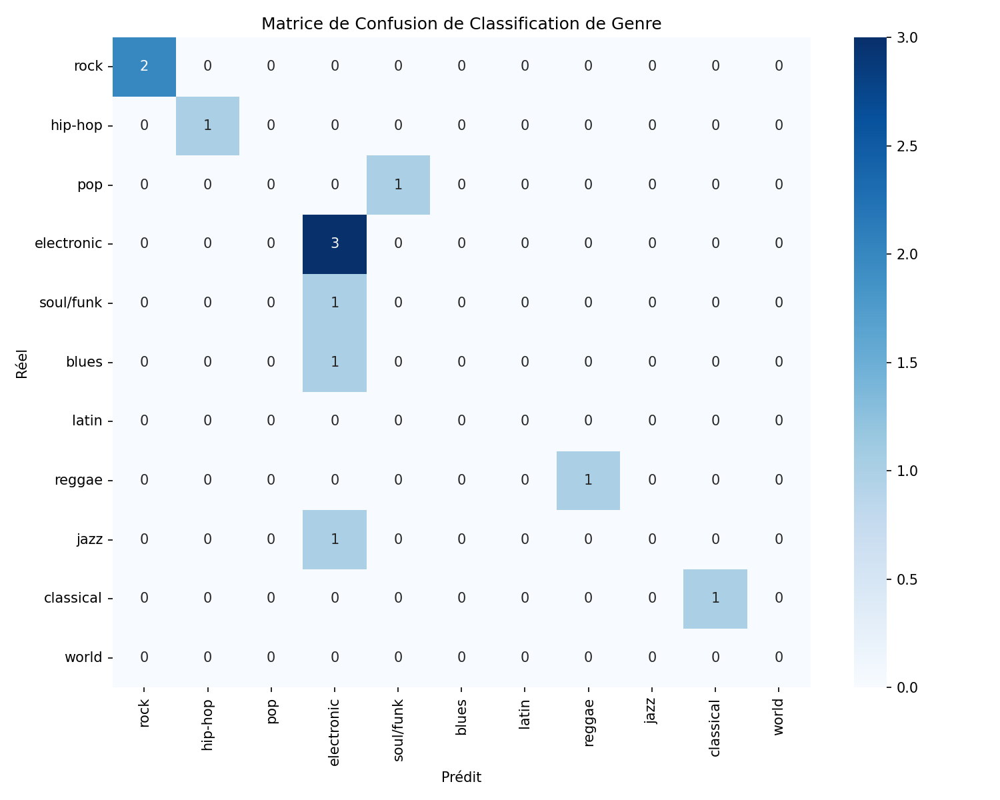

# Analyse de musiques par Intelligence Artificielle pour la classification de genres et instruments de musique.

*Auteurs : MATHIEU Elyes et DUNAND Tom*

---

## Table des matières

0. [Installation et configuration](#0-installation-et-configuration)
1. [Cahier des charges](#1-cahier-des-charges)
2. [Choix des solutions techniques](#2-choix-des-solutions-techniques)
3. [Déroulement du projet](#3-déroulement-du-projet)
4. [Résultats et discussions](#4-résultats-et-discussions)
5. [Avancement](#5-avancement)

---

## 0. Installation et configuration

### 0.1 Prérequis système

- **Python 3.8 à 3.12** (Python 3.13+ n'est pas compatible avec PyTorch CUDA si utilisation du GPU voulue)
- **FFmpeg**

### 0.2 Installation de FFmpeg

#### Windows

1. Télécharger FFmpeg depuis : https://www.gyan.dev/ffmpeg/builds/ (version "essentials")
2. Extraire l'archive
3. Ajouter le chemin du dossier `/bin` au PATH  :
4. Redémarrer le terminal et vérifier avec `ffmpeg -version`

#### Linux

```bash
sudo apt update && sudo apt install ffmpeg
```

### 0.3 Installation des dépendances Python

```bash
# Créer un environnement virtuel
python -m venv .venv

# Activer l'environnement
# Windows:
.venv\Scripts\activate
# Linux/macOS:
source .venv/bin/activate

# Installer les dépendances
pip install -r requirements.txt
```

### 0.4 Installation de PyTorch

#### Version CPU uniquement (recommandée pour la compatibilité)

```bash
pip install torch torchaudio 
```

#### Version GPU (NVIDIA CUDA) - Python 3.8-3.12

Renseignez vous sur la version de CUDA installée sur votre machine puis installez la version de torch et torchaudio correspondante. Cette étape n'est nécessaire que si vous prévoyez d'utiliser le GPU qui n'est pas obligatoire pour les tâches de ce système.

### 0.6 Architecture du repo

```
project/
├── README.md                 # Documentation du projet
├── requirements.txt          # Dépendances Python
├── audio/
│   ├── musique.mp3           # Fichier audio exemple pour test (house)
│   └── evaluation_samples/   # Fichiers audio pour l'évaluation du modèle (à remplir)
├── evaluation_results/       # Résultats d'évaluation (matrice de confusion uniquement pour l'instant)
└── src/
    ├── analyze_music.py      # Script principal d'analyse musicale, utilise le modèle MIT/AST finetuné sur AudioSet
    ├── model_evaluation.py   # Script d'évaluation des performances du modèle sur des musiques choisies personnellement afin d'évaluer en conditions réelles
    └── eval_dataset.py       # Définition du dataset de test (personnel)
```

---

## 1. Cahier des charges

### 1.1 Objectif

### 1.2 Fonctionnalités attendues

### 1.3 Contraintes techniques

---

## 2. Choix des solutions techniques

### 2.1 Modèle de classification : MIT/AST (Audio Spectrogram Transformer)

### 2.2 Dataset d'entraînement : AudioSet

### 2.3 Bibliothèques utilisées

---

## 3. Déroulement du projet

### 3.1 Métriques d'évaluation choisies

### 3.2 Difficultés rencontrées

### 3.3 Méthodes mises en place

---

## 4. Résultats et discussions

### 4.1 Résultats obtenus

### 4.2 Matrice de confusion



### 4.3 Analyse des résultats

### 4.4 Limites du modèle

---

## 5. Avancement

### 5.1 Fonctionnalités implémentées

### 5.2 Améliorations possibles
